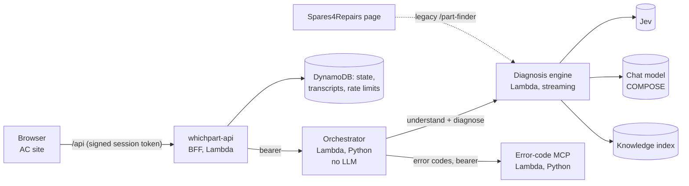

# Appliance Clinic

[](https://github.com/timdodgson/appliance-clinic/actions/workflows/build-and-test.yml)

Appliance Clinic is a production, AI-assisted diagnosis service for household appliances. An owner describes the problem in their own words. The service then:
- asks one useful question at a time;
- walks them through safe checks;
- explains the likely cause;
- points to the right part, or to an engineer.

It covers washing machines, washer-dryers, tumble dryers, dishwashers, fridge-freezers, ovens, hobs, microwaves and vacuums. It runs on AWS Lambda behind a CloudFront site.

This repository holds the production runtime, its infrastructure as code (AWS CDK), the evaluation suites, and the complete record of how the service was migrated out of the monorepo it was born in.

## Why it is built the way it is

A model that is good at understanding "it's making a grinding noise when it tries to empty" is not a safe authority on gas, mains electricity or which part to buy. So the language models have exactly two jobs ([ADR 0010](docs/adr/0010-deterministic-policy-around-llm.md)):

1. **Classify** the customer's latest message into typed facts.
2. **Word** a reply for a decision the deterministic engine has already made.

Everything in between is plain, tested code:
- merge the typed facts into the conversation state;
- score the evidence per journey;
- choose exactly one next action, with safety first and hazards sticky;
- gate any part recommendation.

| | Deterministic (code, unit-tested) | Probabilistic (models) |
|---|---|---|
| Understanding | the typed `mc/1` vocabulary and the merge into `cs/1` state | **Jev** classifies each message into that vocabulary |
| Deciding | journey diagnostics, next-action policy, safety stops, part gate | none |
| Wording | fixed copy for safety stops; template fallback; reply checks (one question, no invented parts, required safety lines) | a chat model words the chosen action |
| Facts | error codes (the MCP service), part catalogue, safety copy | none |
| Retrieval | family-filtered search over a versioned knowledge index | query embedding, where an embedding endpoint is configured |
| Judging quality | pass rules, thresholds | Jev as the GOLD and transcript-review judge |

**Jev** (`typesafe/jev`, through Cloudflare AI Gateway) answers multiple-choice questions with typed, scored choices instead of free text. That makes its output something code can validate.

**Retrieval** never supplies safety rules, error-code meanings, compatibility or stock. Those come from typed sources.

## Architecture



| Component | Code | Role |
|---|---|---|
| `whichpart-api` | `services/whichpart-api` | Backend for the browser: sessions, rate limits, admin (Cognito), transcripts, scheduled transcript review |
| Orchestrator | `orchestration/` | Deterministic turn control: scope, routing, safety, identity, canonical-journey control |
| Diagnosis engine | `services/part-finder` | Jev understanding, the canonical journey engine (`canonical/`), retrieval, COMPOSE, NDJSON streaming |
| Error-code MCP | `error-codes/mcp` | Error-code lookup as MCP tools, plus the admin catalogue |
| Infrastructure | `infra/cdk` | `AcAuthStack`, `AcDataStack`, `AcRuntimeStack` and a dedicated CDK bootstrap |

The diagnosis engine also still serves a legacy `/part-finder` contract for the sister site, Spares4Repairs (S4R). That contract is frozen and checked on every release. Full detail is in [docs/architecture/overview.md](docs/architecture/overview.md).

## Safety

- **Hazards stop the conversation.** A reported hazard (gas smell, burning, shock, water on electrics, sparking) produces a fixed stop-use message, never model prose. The stop stays in force for the rest of the conversation.
- **Precautions travel with checks.** Owner checks carry their own precautions, such as isolating the appliance or containing the water. COMPOSE output is checked, and a missing safety line is restored.
- **Some work is always for a professional.** Live testing, opening microwaves, gas work and bypassing safety devices are declined and handed to a qualified engineer.

## Evaluation

| Layer | What it proves |
|---|---|
| Runtime tests (`npm run test:runtime`) | Unit, contract and journey suites for every runtime, against a recorded known-failure baseline |
| Typecheck (`npm run typecheck`) | Strict TypeScript declarations for the `/part-finder` frames, `cs/1` state, engine configuration and prompt registry |
| Build equivalence (CI) | Rebuilt Lambda zips and container images match the recorded references byte for byte |
| `/part-finder` contract, smoke | Before and after every production release |
| **GOLD v2** | 49 whole-conversation scenarios, judged by Jev on a 10-dimension rubric with critical failures |

The final Phase 8 gate was **49/49 in two consecutive full runs** ([gold-v2-final-gate.md](docs/evaluation/gold-v2-final-gate.md)). The fixes along the way were product fixes; the tests were not weakened ([value audit](docs/evaluation/gold-v2-value-audit.md)).

## AWS and CDK

Production runs in eu-west-1 under three CDK stacks with their own bootstrap ([ADR 0005](docs/adr/0005-dedicated-cdk-bootstrap.md)):
- **Created in place.** The existing resources were *imported* into CloudFormation without recreation ([ADR 0004](docs/adr/0004-import-existing-resources-into-cdk.md)).
- **Reviewed change sets only.** Every production change since is one, made through [`infra/production/steps/change.sh`](infra/production/steps/change.sh): template equality, a change-set checker, a temporary least-privilege execution grant, then drift and no-op checks and a CloudTrail audit.
- **Nothing deploys automatically.** CI has no production credentials.

## The migration

Appliance Clinic began inside the Spares4Repairs monorepo and shared its AWS account. It was separated in phases, with production stable throughout:

| Step | What happened |
|---|---|
| Ownership | Inventory, and ownership proven from CloudTrail |
| Extraction | Byte-identical code extraction, and reproducible builds |
| Rehearsal | A full sandbox rehearsal |
| Import | A gated CDK import |
| Hardening | Dedicated auth, secrets and IAM |
| Cleanup | Architecture cleanup |
| Evaluation | An evaluation-driven product fix-up |

The story, with its decisions and trade-offs, is in [docs/portfolio/project-story.md](docs/portfolio/project-story.md). The evidence is in [docs/migration/](docs/migration/PLAN.md).

## Working on it

You need Node 20 (`>=20 <23`), Python 3.12 and, for images only, Docker with arm64 emulation.

```bash
npm ci                    # root test and typecheck dependencies
npm --prefix tools/migration ci
npm run setup:python      # the two Python test environments, with production package versions
npm run test:runtime      # runtime suites; must match build/test/known-failures.json
npm run typecheck
npm run lint              # migration tooling (ESLint)
npm run test:tooling      # migration tooling tests
npm run build:zips        # build both Lambda zips and compare them with build/reference/
```

- **No credentials needed.** None of these commands needs AWS or model credentials.
- **Credentialed tooling.** The GOLD runner (`tools/gold-v2/run-live.mjs`) and the scripts under `infra/production/` act on the live service. They are owner tools and must not be run casually ([CONTRIBUTING.md](CONTRIBUTING.md)).

## Documentation

| Topic | Where |
|---|---|
| Current architecture | [docs/architecture/overview.md](docs/architecture/overview.md) |
| Configuration, error contracts | [configuration.md](docs/architecture/configuration.md), [error-handling.md](docs/architecture/error-handling.md) |
| Decisions | [docs/adr/](docs/adr/README.md) |
| Prompts and their versioning | [prompts/README.md](prompts/README.md) |
| Evaluation | [docs/evaluation/](docs/evaluation/gold-v2-final-gate.md) |
| Migration plan, results, runbooks | [docs/migration/PLAN.md](docs/migration/PLAN.md), [runbooks](docs/migration/runbooks/README.md) |
| Project story | [docs/portfolio/project-story.md](docs/portfolio/project-story.md) |
| Contributing, security | [CONTRIBUTING.md](CONTRIBUTING.md), [SECURITY.md](SECURITY.md) |

## Licence

Licensed under the [Apache License, Version 2.0](LICENSE). Copyright 2026 Tim Dodgson; see [NOTICE](NOTICE).
