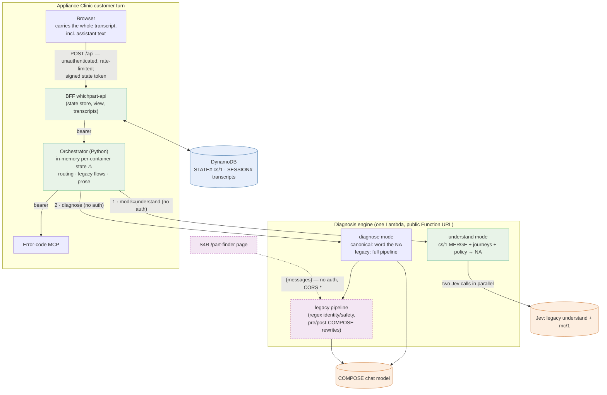

# As-built architecture (Phase 10 truth audit)

This describes what the code at `ec48371` does, as traced from source, from the live Lambda configuration, and from production logs and transcripts. Where the earlier [overview](overview.md) disagrees, this document is the evidence. The overview has been corrected to match it.

Abbreviations: BFF = `services/whichpart-api`; orch = `orchestration/`; engine = `services/part-finder`; cs/1 = canonical conversation state; mc/1 = canonical message classification; NA = NextAction.

## Diagram

Key: green = deterministic code, orange = model, blue = durable state, dashed purple = the S4R boundary (code shared with S4R).

## The AC turn, hop by hop

| # | Hop | Source | Auth | State | Deterministic | Model | Failure behaviour |
|---|---|---|---|---|---|---|---|
| 1 | Browser → BFF | `whichpart-api/index.js` | None on the chat route; rate limit only | The client sends up to 12 messages, assistant turns included | Windowing, sanitising | — | Bad JSON: 400 |
| 2 | Canonical prepare | `conversation-state.js` `prepareTurn` | HMAC state token. The previous token secret is still the old `spares4repairs/dev/…` secret, and it is read | Reads `STATE#`; re-runs `merge` only to recover one missed write | Mode `control`; allow-list of 63 journeys (live value, equal to the registry) | — | Any failure: `degraded`, and the turn continues on the legacy path. **Logs only** |
| 3 | BFF → orch | `index.js` | Bearer. 120 s; retries on 429 only | `pendingRequest` is **not** forwarded | — | — | Throw or timeout: "Sorry — something went wrong" with `error:true` |
| 4 | Orch `_load` | `orchestrator.py` | — | **Owns an in-memory `ConversationState` per container.** It is lost on a cold start, not shared between containers, and never cleared. It holds latches: the safety high-water mark, `unsafeIntent`, model-unavailable and the family | Family gate (Jev probabilities); make from a brand regex; code value recovery (regex); identity precedence | — | — |
| 5 | Orch → engine, understand | `services.py` | **None** (public URL). 90 s; no retry | — | — | — | Error: `RagUnavailable`, then an empty typed state and a generic clarify (**masked**) |
| 6 | Engine understand | `part-finder-lambda.js`, `canonical-runtime.js` | — | **cs/1 merge runs here every turn**, then journey routing, diagnostics, policy and the NA. Under control, the request is written into the state | Merge, diagnostics, policy, part gate | **Two Jev calls in parallel**: legacy understand (3 × 15 s) and mc/1 (2 attempts, 15 s grace) | A legacy Jev failure is returned as a **successful** degraded intent |
| 7 | Orch routing | `orchestrator.py` `handle_turn` | — | — | Scope refusal; canonical when the NA is controlled and allow-listed; otherwise `routing.route` → error code / symptoms / combined / clarify | — | — |
| 8a | Canonical: orch → engine diagnose | `_flow_canonical` | None; 90 s | Reads the transported state | Maps the NA to an outcome; **still prepends the latched unsafe-intent warning** | COMPOSE words the NA (`compose-kit.js`), with `checkReply` | Provider error: `compose_failed`, which the BFF turns into an explicit error (#21). Other violations: silent template. Diagnose transport error: "can't run the diagnosis", **but the advanced cs/1 is still persisted** |
| 8b | Legacy: orch flows | `_flow_*` | MCP bearer | Updates the latches | The orchestrator **writes its own prose**: clarify questions, model asks, staging text, MCP code text, safety notes. It can **replace** engine replies | Engine legacy COMPOSE | MCP down: SERVICE_UNAVAILABLE text with **no `error:true`** |
| 9 | BFF view and persistence | `index.js`, `conversation-state.js` `finishTurn` | — | Stores the engine-merged cs/1 (no merge) | `needsModel` regex; "Worth checking:" strip | — | Store failure: logged; the reply is still sent |
| 10 | Transcript | `transcript-store.js` | — | `SESSION#` record, only when the client sent observability | — | — | Errors swallowed; if the store cannot be built, falls back to memory |
| 11 | Transcript review | EventBridge, every 15 min | — | Writes `review` | Eligibility | Jev (live provider `jev`) | Unparseable output: per-record error |

## The S4R turn

| # | Hop | Notes |
|---|---|---|
| S1 | S4R page → engine Function URL | No auth, CORS `*`. Accepts `{messages}` **and** every orchestrator-only field: `mode`, `understand`, `canonical`, `established`, `seed`, `feedback` |
| S2 | Retrieval | Regex family cues, embeddings with a lexical fallback |
| S3 | Inline Jev understand | A failure **throws** a 503 (not masked) |
| S4–S8 | Legacy decision chain, parts, COMPOSE, post-COMPOSE rewrites | About 20 pre-COMPOSE rules and about 10 post-COMPOSE rewrites. Several replace model prose with fixed copy |
| S9 | NDJSON `delta` + `done` | The contract is pinned by `tools/migration` and checked on every release |

## Answers to the review questions

| Question | Answer |
|---|---|
| Who owns conversation state? | cs/1 content is merged by the **engine** on every turn and stored by the **BFF**. But six other representations exist at once: the orchestrator's in-memory state (with latches), the client-carried transcript, engine "progress" rebuilt from history, the legacy Jev intent, `pendingRequest`, and the transcript record. **No single owner** |
| Who owns progression / NextAction? | Canonical policy on controlled turns. On legacy turns: about 20 engine rules, about 10 engine post-COMPOSE rewrites, the orchestrator's `_journey_stage` and clarify flows, and the BFF's `needsModel`. "Ask for the model" is decided in at least five places |
| Who owns safety? | Five implementations: engine `safety.js` (regex), the engine COMPOSE prompt, canonical `policy-kit` + `compose-kit`, the orchestrator `_safety_block` / owner note / unsafe-intent latch, and the BFF suppression. The owner safety note is written three times and the gas emergency text four times |
| Who owns identity? | Family: legacy Jev, mc/1, the orchestrator gate, engine regex cue tables, catalogue lookup. Make: two different brand lists plus Jev and mc/1. Model and code: Jev, orchestrator regex recovery, engine regex, MCP, image extraction |
| Who owns evidence? | `canonical/evidence-engine.js` is a line-for-line copy of `engine/evidence.js` scoring (equivalence-tested) |
| Who owns COMPOSE? | Two prompt families: canonical (`compose-kit.js`, one per pack) and legacy (`engine/compose.js`). Canonical output is checked by `checkReply`; legacy output by regex rewrites |
| Duplicated decisions | Model ask (5 places), scope refusal (orch and engine, same field), recovery and closure (engine regex and orch Jev field), vague-opener clarify (engine and orch) |
| Fallbacks that mask errors | Understand failure → generic clarify; SERVICE_UNAVAILABLE as a normal reply; cs/1 advanced although diagnose failed; `checkReply` → silent template; parts API failure → "no parts"; in-memory transcript store; orchestrator state miss resets latches silently |
| Retry layers | BFF→orch: 429 only. Orch→engine: none (two sequential 90 s calls inside a 120 s Lambda). Engine→Jev: 3 × 15 s. Engine→COMPOSE: 240 s. These are not duplicated retries, but the budgets do not fit together |
| Public engine URL controls | None. The orchestrator-only fields can bypass scope refusal and safety classification, word an arbitrary NextAction and inject part cards. Effects reach only the caller's own response, but every request is written to the S3 learning trace |
| Config not in the repo | `CANONICAL_MODE` and `CANONICAL_CONTROL_JOURNEYS` are live-only. Verified live: `control` with 63 keys, equal to the registry (the "64" in Phase 0 was out of date). The engine kill switches are not set (the defaults apply) |

## Runtime evidence used

- Live Lambda configuration (non-secret names and values only): canonical mode and allow-list, the transcript-review provider, engine environment variable names.
- CloudWatch:
  - the 2026-10-07 COMPOSE failures were provider HTTP 400 (account suspended);
  - Jev's decision probabilities for the R29/R30 turns.
- Transcripts: the canonical audit of 304 turns since 2026-10-05 (289 controlled, 15 legacy).

The full hop tables with file and line references, the per-question evidence and the ranked refactor list are in [as-built-trace.md](as-built-trace.md). The target is in [target.md](target.md).
