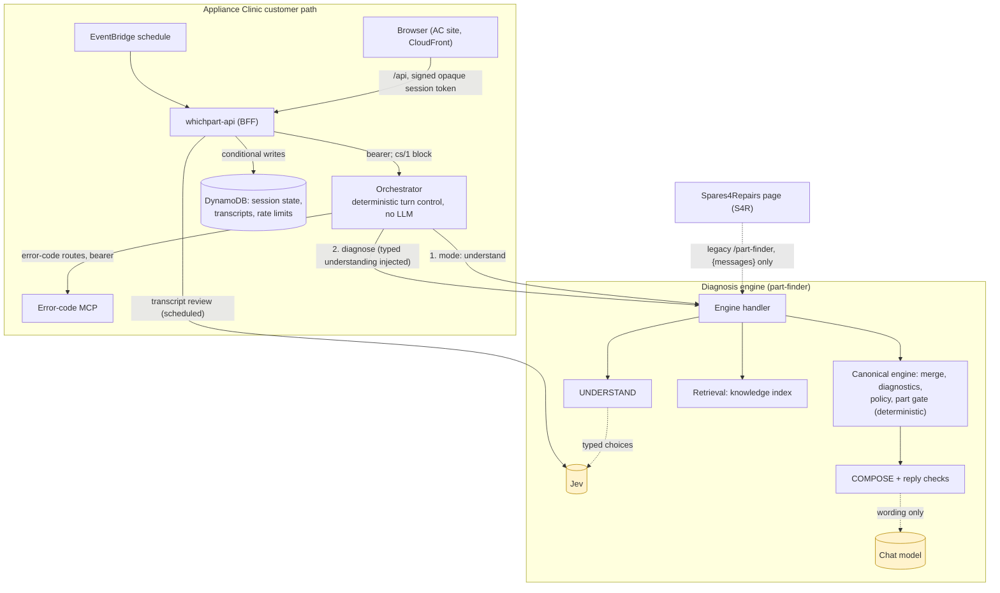

# Architecture overview

This describes the system as it runs in production. It is the one current-state architecture document. The decisions
behind it are in [`docs/adr/`](../adr/README.md). The Phase 8 review that produced this page is
[phase-8-findings.md](phase-8-findings.md); it is kept as the record of that review. The Phase 10 truth audit traced
every hop from code and production evidence: [as-built.md](as-built.md) (with the line-level
[trace](as-built-trace.md)) and the [target architecture](target.md). Where this page summarises, those are the
evidence.

Dotted lines into a shaded box are the only places a model is used. The dotted S4R line is the frozen legacy contract,
which is served but not developed.

## Where the language models are, and are not

| Step | Owner | Model? |
|---|---|---|
| Classify the latest message into the typed `mc/1` vocabulary | Jev (`diagnosis.jev.understand`, `diagnosis.jev.mc1`) | Yes: typed choices, validated by code. A canonical turn makes **two** Jev calls in parallel (legacy understand and mc/1) |
| Merge into `cs/1` state, request outcomes | `canonical/merge.js`, `requests.js` | No |
| Diagnose (evidence against cause families) | `canonical/*-diagnostics.js`, `evidence-engine.js` | No |
| Choose the one next action; safety stops; part gate | `canonical/*-policy.js`, `policy-kit.js` | No |
| Turn control, routing, safety blocks, model-ask staging | orchestrator | No. On legacy turns it also writes customer prose (clarify questions, model asks, staging and error-code text) |
| Word the chosen action | COMPOSE (`diagnosis.canonical.compose`, legacy `diagnosis.compose.*`) | Yes: then checked; template on failure; safety stops never |
| Error-code meaning | Error-code MCP | No |
| Retrieval ranking | `retrieval.js` | Embedding only, where configured; lexical otherwise |
| Transcript review, GOLD judge | Jev (`review.transcript.*`, `benchmark.gold-v2.judge`) | Yes, offline from the customer path |

## Components

| Component | Code | Runs as | Owns |
|---|---|---|---|
| **AC site** | Not in this repository: the static site is still published from the original monorepo (`apps/whichpart`) | Static files in S3 `whichpart-web-<account>` behind CloudFront | Customer chat UI, admin UI |
| **BFF** (`whichpart-api`) | `services/whichpart-api` | Lambda zip, Function URL, CloudFront `/api*` origin | Customer turns, AC sign-in, admin, scheduled jobs, canonical session state, transcripts |
| **Orchestrator** | `orchestration/` (Python) | Lambda image `spares4repairs-diag-orchestrator` (arm64) | Turn control: scope, routing, canonical control, legacy flows, safety, identity. No language model. Keeps a per-container in-memory session state with latches (to be retired: [ADR 0014](../adr/0014-cs1-is-the-only-conversation-state.md)) |
| **Error-code MCP** | `error-codes/mcp` (Python) | Lambda image `spares4repairs-error-code-mcp` (arm64) | Error-code tools (MCP over HTTP), error-code admin catalogue |
| **Diagnosis engine** (`part-finder`) | `services/part-finder` | Lambda zip `spares4repairs-part-finder`, public Function URL (response streaming) | UNDERSTAND (Jev), retrieval, decisions, COMPOSE, the NDJSON stream. **Also the S4R `/part-finder` backend** |

**Inside the two JavaScript runtimes (since Phase 8).** Both are split into modules that form an acyclic graph. The
entry file keeps the handler.

- **Diagnosis engine.** `part-finder-lambda.js` holds the streaming handler and the canonical-runtime wiring.
  `engine/` holds `config`, `conversation`, `catalogue`, `intent-vocabulary`, `error-codes`, `evidence`, `safety`,
  `presentation`, `progression`, `media-concepts`, `parts-client`, `learning-log`, `understand` and `compose`.
  `canonical/` is the canonical engine.
- **whichpart-api.** `index.js` holds the handler, the router and the customer diagnosis path. It has:
  - base modules: `config`, `log`, `http-io`, `rate-limiting`, `session`, `s3`, `benchmark-state`, `transcript-store`
  - admin areas under `admin/`: `content` (knowledge and media), `recalls`, `transcripts`, `health`, `error-codes`,
    `diagnostics`, `test-area`, `settings`

Data: DynamoDB `whichpart-transcripts`, `whichpart-recalls`, `applianceclinic-rate-limits`; S3
`whichpart-learning-<account>` (learning traces, knowledge and media overlays, test-area data).

## Request flows

**AC customer turn**

1. Browser → CloudFront `/api/...` → `whichpart-api`. The browser sends the conversation it shows (customer and
   assistant turns, up to 12) and a signed state token; the chat route itself is not authenticated, only rate-limited.
2. `whichpart-api` loads the conversation state, applies the rate limit, and calls the orchestrator with its bearer,
   attaching the canonical cs/1 block.
3. The orchestrator calls the diagnosis engine's Function URL twice:
   - `mode: understand`: Jev classifies the latest message
   - diagnose: the typed understanding is injected
   On error-code routes it also calls the MCP with its bearer.
4. `whichpart-api` maps the result to the WhichPart view, persists the transcript and the new state (conditional
   write), and returns. The cs/1 merge itself runs in the engine's understand call; the BFF stores the result and
   re-merges only to recover one missed write.

**S4R `/part-finder` turn**

1. The S4R page calls the diagnosis engine's Function URL directly, with `{messages}` only.
2. The engine runs Jev UNDERSTAND in process, then the legacy pipeline, and streams NDJSON.

The contract is pinned by `tools/migration` (`baseline contract verify`) and must not change.

**Admin request:** browser → `/api/admin/...` → `whichpart-api`, which checks an AC Cognito session in the `admin` group
before any admin handler runs.

**Scheduled jobs (EventBridge → `whichpart-api`):** recall ingest and transcript review.

## Canonical and legacy

| Path | Status | Reached by |
|---|---|---|
| Canonical control (`services/part-finder/canonical/*`, orchestrator canonical branch) | **Canonical** | AC turns on allow-listed journeys. `whichpart-api` runs `CANONICAL_MODE=control` with `CANONICAL_CONTROL_JOURNEYS` listing them |
| Legacy pipeline (part-finder handler decision chain and COMPOSE) | **Legacy, retained** ([ADR 0012](../adr/0012-legacy-diagnosis-pipeline-retained.md)) | Every S4R request; AC turns no canonical journey owns; AC fallback when canonical degrades |
| Orchestrator legacy flows (`_flow_error_code`, `_flow_symptoms`, `_flow_combined`, `_flow_clarify`) | **Legacy, retained** | AC turns not under canonical control |
| In-process generative UNDERSTAND | **Removed** in Phase 8 | Nothing; Jev replaced it |
| `POST /ai/chat` on the S4R HTTP API | **Retired** in Phase 7 (C1) | Nothing reaches the engine through it |

Rollback of canonical control is configuration only: `CANONICAL_MODE=shadow` or `off` on `whichpart-api`, or one
journey key dropped from `CANONICAL_CONTROL_JOURNEYS`; per-journey engine kill switches `CANONICAL_Jx_CONTROL=0` also
exist. The live mode and allow-list (control, 63 journeys, equal to the registry) are set on the function and are not
yet in `runtime-overrides.json`.

## Authentication

| Boundary | Mechanism |
|---|---|
| Customer browser → `whichpart-api` | No authentication on the chat route; rate limit by hashed key. The cs/1 state token is HMAC-signed (`applianceclinic/production/canonical-state-token`; the previous-key slot still names the old `spares4repairs/dev/applianceclinic-canonical-state-token`) |
| Admin browser → `whichpart-api` | AC Cognito user pool (`AcAuthStack`), group `admin`; the BFF checks it per request |
| `whichpart-api` → orchestrator | Bearer `applianceclinic/production/orchestrator-bearer` |
| `whichpart-api`, orchestrator → MCP | Bearer `applianceclinic/production/mcp-bearer` |
| Anyone → diagnosis engine URL | **Unauthenticated (public).** S4R's browser calls it. The fields `mode`, `understand`, `canonical`, `established`, `seed` and `feedback` are meant for the orchestrator only but are not yet authenticated ([ADR 0017](../adr/0017-authenticate-orchestrator-only-engine-fields.md)) |
| Engine → Jev, OpenAI | Provider credentials from `applianceclinic/production/{jev,openai}` |

## Secrets and configuration

- **Secrets** live in Secrets Manager under `applianceclinic/production/*` (`AcDataStack`).
  - Lambdas receive secret **ids** in environment variables, never values.
  - Bearers are resolved through CloudFormation dynamic references.
  - The old `spares4repairs/dev/applianceclinic-*` secrets are not deleted. One is still read: the previous-key slot
    of the state token (`CANONICAL_TOKEN_PREVIOUS_SECRET_ID`).
  - The legacy bearer secrets (`spares4repairs/{diag-orchestrator,error-code-mcp}/bearer-token`) were deleted in
    Phase 9 ([phase-9-results.md](../migration/phase-9-results.md)).
- **Configuration** is environment variables on each Lambda, owned by `AcRuntimeStack` (`infra/cdk/config/runtime-overrides.json`).
  - Changing a value is a CDK change, not a console edit.
- **Admin-editable AI settings** (models, prompts toggles) are stored in the `ai-config` secret and written by the
  Settings page.
- **Every environment variable** each runtime reads is listed in [configuration.md](configuration.md): required or
  optional, its default, and whether production sets it. The defaults that still point at production or S4R are listed
  there too. A test fails on an undocumented variable.

## Prompts and contracts

- **Prompts.** Every prompt is registered in [`prompts/registry.json`](../../prompts/registry.json) with a stable id,
  version, purpose, contract and changelog ([ADR 0013](../adr/0013-prompt-registry-and-contract-types.md);
  [`prompts/README.md`](../../prompts/README.md) explains how to change one). The diagnosis prompts used by S4R are
  S4R-facing.
- **Contract types.** [`types/`](../../types/) declares the `/part-finder` frames, cs/1, the engine configuration and the
  prompt registry. `npm run typecheck` (CI job `typecheck`) checks the runtime against them under strict TypeScript.
- **Errors.** Each boundary's error contract is described in [error-handling.md](error-handling.md).

## Evaluation

| Check | What it covers | When |
|---|---|---|
| Runtime tests (`npm run test:runtime`) | Unit, contract and journey suites, against the known-failure baseline (`build/test/known-failures.json`). Retired suites stay retired | Every pull request |
| `/part-finder` contract (`baseline contract verify`) | Status, CORS, NDJSON framing and the fields S4R reads | Before and after every engine release |
| Smoke (`baseline smoke`) | Four journeys against the pre-migration baseline | Before and after every runtime release |
| Transcript review judge | Semantic review of production conversations (`review.transcript.*` prompts), summarised by `overall` from the `transcript-review-ok` log events | Scheduled; compared before and after releases |
| GOLD v2 | Semantic whole-conversation benchmark (GOLD-v2.2, 49 scenarios) with Jev as the fixed judge (`benchmark.gold-v2.judge`). Latest gate: 49/49 twice ([final gate](../evaluation/gold-v2-final-gate.md)) | Owner-run (admin test area, or `tools/gold-v2/run-live.mjs`); needs the live transport and Jev credentials |

Behaviour is never scored by regular expressions; semantic judgement uses the Jev or language-model judges above.
(Behaviour is still *produced* by regular expressions in places — safety cues, brand lists, legacy rewrites; see
[as-built Q10](as-built-trace.md#q10-regex--string-matching-used-as-behaviour-most-significant).) The transcript-review
provider is configurable (`TRANSCRIPT_REVIEW_PROVIDER`; production: `jev`).
[ADR 0009](../adr/0009-evaluation-strategy.md) has the strategy.

## Infrastructure ownership (CDK)

| Stack | Holds |
|---|---|
| `AcAuthStack` | AC Cognito user pool, app client, `admin` group |
| `AcDataStack` | DynamoDB tables, S3 learning and web buckets, `applianceclinic/production/*` secrets, ECR repositories |
| `AcRuntimeStack` | The four Lambda functions, their Function URLs and permissions, execution roles and policies, EventBridge schedules |
| AC CDK toolkit | Bootstrap for the above ([ADR 0005](../adr/0005-dedicated-cdk-bootstrap.md)) |

Not owned: the CloudFront distribution ([ADR 0008](../adr/0008-cloudfront-initially-unmanaged.md)), and everything S4R
owns ([ADR 0003](../adr/0003-s4r-compatibility-boundary.md); [ownership.md](../migration/ownership.md)).

Every production change goes through `infra/production/steps/change.sh`:

1. synthesise
2. template equality check
3. change set with the checker
4. temporary least-privilege execution policy and stack policy
5. execute
6. drift and no-op check
7. restore

## Runbook and rollback

- **Health:**
  - `infra/production/verify-ac-endpoints.sh`
  - `verify-ac-auth.sh`
  - `s4r-boundary.sh`
  - `tools/migration` `baseline contract verify` (`/part-finder`) and the smoke compare
- **Runtime code release:**
  - build the zip with `build/scripts/package_zips.py`
  - deploy through a `change.sh` spec that sets `functions.<name>.code`
  - update `build/reference/*.zip.json` in the same pull request (CI requires the built zip to equal it)
  - register added, changed or removed runtime files in `docs/migration/runtime-changes.json`
- **Rollback:** revert the pull request and run the same change with the previous artefact. Each release spec records
  the previous code SHA-256. The published Lambda version `1` of `whichpart-api` is a further fallback.
- Phase runbooks: [`docs/migration/runbooks/`](../migration/runbooks/README.md).
