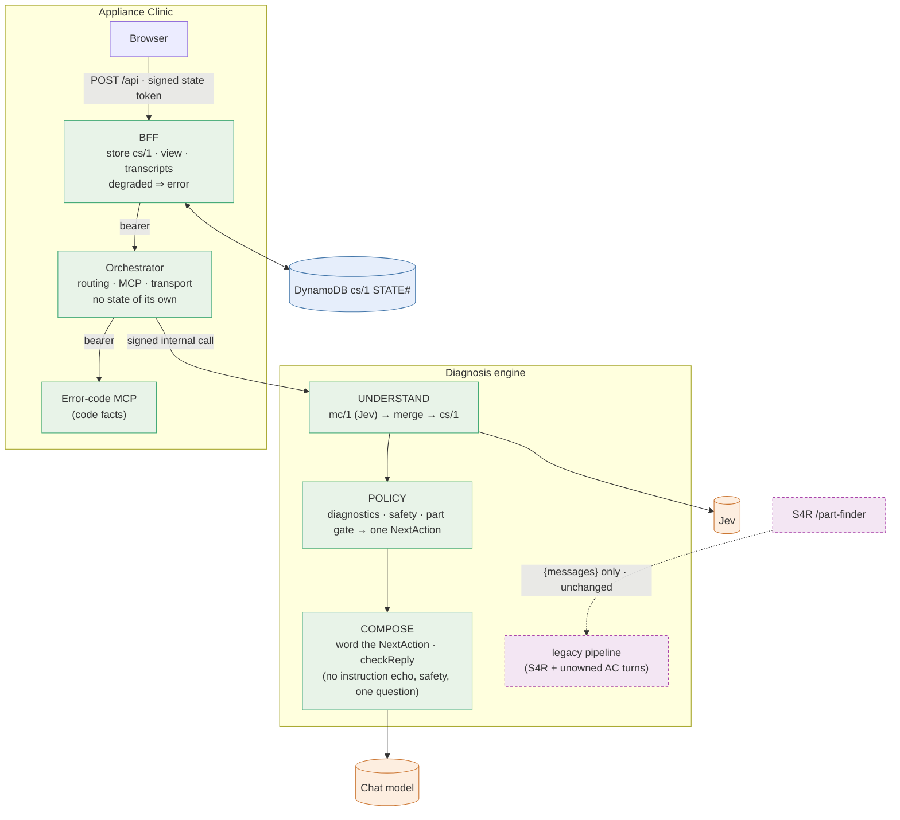

# Target architecture (Phase 10)

The [as-built audit](as-built.md) found that each customer decision has several owners: state, NextAction, safety, identity and wording. The real defects came from the seams between those owners. Three examples:
- **A code typed as a model.** One layer committed a weak model guess, and another layer then trusted it.
- **A prompt leak.** The prompt contract had no check that the model's instructions stay out of the reply.
- **A clarify loop.** The orchestrator wrote its own question and did not look at what it had already asked.

The target keeps what works. It does not replace Jev, the canonical engine, or the S4R contract.

## Principles

1. **One state.** cs/1 is the only conversation state. Everything a later turn depends on is a typed cs/1 fact: the identity, the evidence, the requests asked and their outcomes, sticky hazards and declines. Nothing that changes a reply lives in process memory ([ADR 0014](../adr/0014-cs1-is-the-only-conversation-state.md)).
2. **One owner per decision.**
   - The engine's canonical policy decides the NextAction.
   - COMPOSE or fixed copy words it.
   - The orchestrator routes, calls the MCP and transports the result. It does not write customer prose on canonical turns, and on legacy turns it writes only from typed state.
   - The decisions are given single owners ([ADR 0015](../adr/0015-one-owner-per-decision.md)).
3. **A model's uncertainty has a deterministic consequence.** A Jev answer below its commit threshold is not committed as a fact. The policy asks the disambiguating question instead. This already holds for the appliance family; the target extends it to code versus model.
4. **Degraded is an error, never a normal reply.** A turn that could not run its decision path is flagged in the view and the transcript. Its state change is not persisted ([ADR 0016](../adr/0016-degraded-turns-are-errors.md)).
5. **The model's instructions never reach the customer.** COMPOSE output is checked against the prompt's own instruction lines. A reply that echoes them is replaced by the template.
6. **The S4R boundary is explicit.** The S4R `{messages}` contract is unchanged. The orchestrator-only engine fields are accepted only from an authenticated caller ([ADR 0017](../adr/0017-authenticate-orchestrator-only-engine-fields.md)).

## Diagram

## Migration plan

| Step | Change | Phase 10? | S4R impact |
|---|---|---|---|
| T1 | COMPOSE: the media note becomes a fact; `checkReply` rejects instruction echo; the template stops repeating safety lines that are already present; a COMPOSE error records its class | Yes | None (canonical modules only) |
| T2 | UNDERSTAND/merge: an `answered` toPending with no target fact becomes `partial` (re-offered once); the mc/1 option wording no longer counts a bare yes or no as an answer | Yes | None |
| T3 | Orchestrator: a low-confidence Jev model is not committed (the existing family-gate rule, applied to the token); the identity clarify asks only for what is missing and does not repeat itself; the code reply drops fragmentary causes and gives a next step; the owner note goes only on turns that give a physical step | Yes | None |
| T4 | Degraded turns: SERVICE_UNAVAILABLE is flagged `error:true` and `degraded`; cs/1 is not persisted when the NextAction was not delivered | Yes | None |
| T5 | GOLD v2.3: error-code and either/or scenarios; rubric-wide fidelity critical failures; COMPOSE mode recorded per turn | Yes | None |
| T6 | Authenticate the orchestrator-only engine fields: an HMAC header from the orchestrator; without it the fields are dropped | Planned (ADR 0017). Needs a new secret and both Lambdas; gated on S4R evidence | Gated: S4R never sends these fields (verified from logs before release) |
| T7 | Retire the orchestrator's in-memory state: move the remaining latches into cs/1, then delete `InMemoryStateStore` | Planned (ADR 0014) | None |
| T8 | Bridge error codes into canonical journeys: the MCP's typed system (for example door-lock) opens the matching journey | Planned (ADR 0015) | None |
| T9 | One safety-copy source shared by Python and JS; one evidence-scoring module; one brand list | Planned | The legacy engine imports must stay byte-equivalent for S4R, or move behind the same gate |
| T10 | Regenerate the error-code enrichment with complete cause sentences (the generator truncates them) | Planned | None |

The steps are ordered so that each release can be rolled back on its own. T1–T5 address the real defects. T6–T10 remove the seams that produced them.
